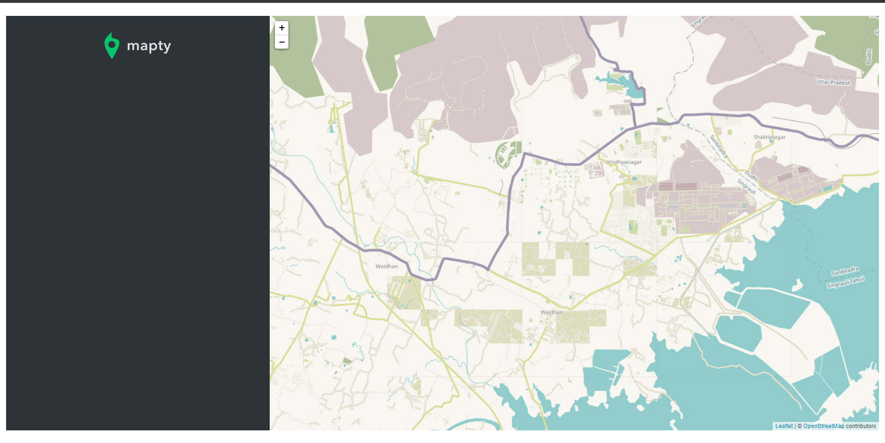

<div align="center" id="top"> 
  
</div>

<hr>
<br>

# Mapty

Mapty is an application built with modern javaScript and an open-source JavaScript library Leaflet.
to make the user able to log his workout. Select the location on the map where he want to work out 

## Quick start

Clone the Project 
```bash
git clone https://github.com/Ahmedashref26/Mapty.git
``` 

---
## Usage

you can log your workout. Select the location on the map where you want to work out then on the form where you can input your workout, in the sidebar, fill the details then the info gets logged in the location. You can also log multiple workouts in different locations. The application allows you to log cycling and running 
workouts.

## Features

When you click on the workout in the sidebar, it will move you to the workout lcation in the map.
When you close the map and reload it, the application will keep its state
The map is loaded from a third party service and the position is automatically obtained using the geolocation.

[](./p2.png)
[](./p1.png)

## Project Flowchart & Architecture

[](./Mapty-flowchart.png)
[](./Mapty-architecture-final.png)
---
## License

MIT
